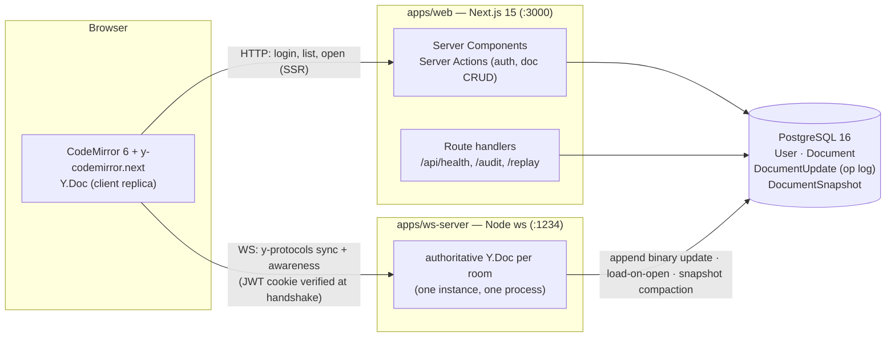

# Collab Editor — real-time collaborative Markdown

A full-stack, real-time collaborative Markdown editor: many users edit the same
document at once with **no lost writes**. Conflict resolution is handled by a
**CRDT** (Yjs `Y.Text`), synchronization by a **custom WebSocket server**, and
durability by an **append-only op log + periodic snapshot checkpoint**
(event-sourcing-lite).

> "Optimistic concurrency" here means **reconcile, not reject**. Naive
> last-write-wins loses data; with a CRDT every replica edits independently and
> merges deterministically — no edit is dropped.

---

## Architecture

Two processes share one Postgres schema. The Next app owns auth, SSR, and CRUD;
the standalone ws-server owns live sync and persistence. They do **not** talk to
each other directly — the database is the only shared state.



**Fixed decisions** (rationale in `docs/adr`): Yjs `Y.Text` · CodeMirror 6 +
`y-codemirror.next` · `y-protocols` wire format · custom `ws` server as a separate
process (Next App Router has no native WS) · Postgres op log + snapshot compaction ·
SSR bootstrap via Server Component, client WS takes over · Prisma ORM · JWT in an
httpOnly cookie, verified at both REST and the WS handshake.

### Invariants (never violated)

1. State is stored/transferred as **binary Yjs updates** — never a text diff.
2. Every WS connection passes **auth before its first message**.
3. The op log is **append-only**; order is **snapshot commit → prune**.
4. A document's authoritative `Y.Doc` is a **single instance in one process** (single-node).
5. Versioning is Yjs's **state vector** — no hand-maintained integer `version` column.

---

## Quickstart

**Prerequisites:** Node 20 LTS, pnpm 9, Docker (for Postgres).

```bash
# 1. Install
pnpm install

# 2. Environment — copy the example and adjust if needed
cp .env.example .env        # DATABASE_URL + JWT_SECRET (a single root .env, loaded by both apps)

# 3. Database
docker compose up -d        # Postgres 16 on :5432
pnpm db:migrate             # apply Prisma migrations
pnpm db:generate            # generate the Prisma client

# 4. Run both processes (web :3000 + ws-server :1234)
pnpm dev
```

Open http://localhost:3000 → register → create a document → open it in two
browser windows and type. Edits merge live; each window shows the other's cursor.
Open **History / replay** on a document to inspect its op log and reconstruct the
text at any past point.

### Commands

| Command | What |
|---------|------|
| `pnpm dev` | web + ws-server in parallel |
| `pnpm --filter web dev` / `--filter ws-server dev` | one process |
| `pnpm db:migrate` · `pnpm db:studio` | Prisma migrate / studio |
| `pnpm test` | vitest unit tests (all packages) |
| `pnpm test:e2e` | Playwright multi-client E2E (auto-boots both servers) |
| `pnpm typecheck` | `tsc --noEmit` across the workspace |

---

## Monorepo layout

```
apps/
  web/          Next.js App Router — UI, Server Actions, REST auth, audit/replay endpoints
  ws-server/    Standalone Node ws server — Yjs sync + persistence
packages/
  db/           Prisma schema + client (imported by both apps; loads the root .env)
  protocol/     WS message types + JWT sign/verify (shared REST/WS identity)
  shared/       Shared types, zod schemas, CRDT reconstruction helpers
```

---

## Tests

- **Unit** (`pnpm test`, vitest): password hashing, session tokens, CRDT
  reconstruction, op-log replay planning (pure, DB-free).
- **E2E** (`pnpm test:e2e`, Playwright): the config boots the web app and
  ws-server itself (reusing any already running), then:
  - `collab.spec` — two clients co-edit, remote cursors, offline edit merges on reconnect.
  - `concurrent.spec` — four clients converge; simultaneous same-caret inserts lose nothing.
  - `replay.spec` — the replay endpoint reconstructs exact text at a known point; owner-gated.
- **Load note** (capacity probe): `pnpm --filter ws-server exec tsx scripts/faz7-load.ts [N]`
  — N clients in one room converge with no lost writes (single-node model, invariant #4).
- **Persistence smoke** (real DB): `apps/*/scripts/faz*-smoke.ts` per phase.

---

## Why CRDT, not OT?

Both solve the same problem — concurrent edits to shared text without lost writes —
but differently:

| | **OT** (Operational Transformation) | **CRDT** (this project — Yjs) |
|---|---|---|
| How it merges | Transforms each op against concurrent ops | Ops commute by construction; merge is deterministic |
| Needs a central server? | Yes — a server sequences and transforms ops | No — any two replicas merge to the same state |
| Correctness burden | A transformation function per op pair; famously subtle | Convergence is a property of the data type |
| Offline / P2P | Hard — depends on the ordering server | Natural — merge on reconnect, any order |
| Cost | Small metadata | Per-character identity metadata (Yjs keeps this compact) |

We chose CRDT because convergence is guaranteed by the data structure rather than by
a hand-written, easy-to-get-wrong transform, and because it survives offline editing
and reconnection cleanly — exactly the "reconcile, not reject" goal. Yjs is a mature,
compact CRDT implementation with battle-tested editor bindings. The trade-off we accept
is per-character metadata overhead, mitigated by Yjs's encoding and by snapshot
compaction of the op log. (Longer notes: `docs/concepts/crdt-vs-ot.md` in the spec bundle.)

---

## Documentation

The authoritative project context lives in `docs/` (Turkish source of truth):
`docs/CLAUDE.md` (decisions, invariants, roadmap), `docs/claude-code-playbook.md`
(workflow), and `docs/collab-editor-spec.zip` (ADRs 0001–0005, concept notes). The
root `CLAUDE.md` is the English summary for tooling.
